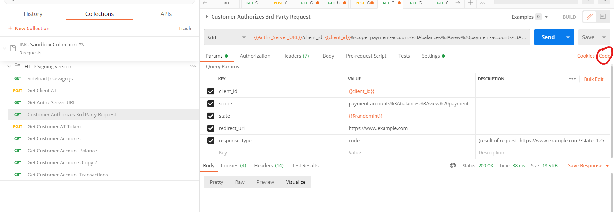

## Postman tutorial

download Postman client 64 bit
https://www.postman.com/downloads/

Ga naar de ING Sandbox Collection in de Postman Desktop Client

Configure certificates in Settings

Send script 1 : sideload.js

Send script 2 : Get Client AT

Send script 3 : Get Authz Server

Maak een CURL script van script 4: Customer Authorizes 3rd party request

Kopieer CURL script in browser. Selecteer een account en klik op OK

Kopieer Authorization Code

Zet Authorization Code in body

Send script 5: Get Customer AT

Send script 6: Get Customer Accounts
