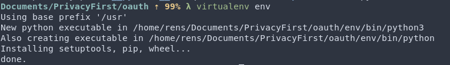
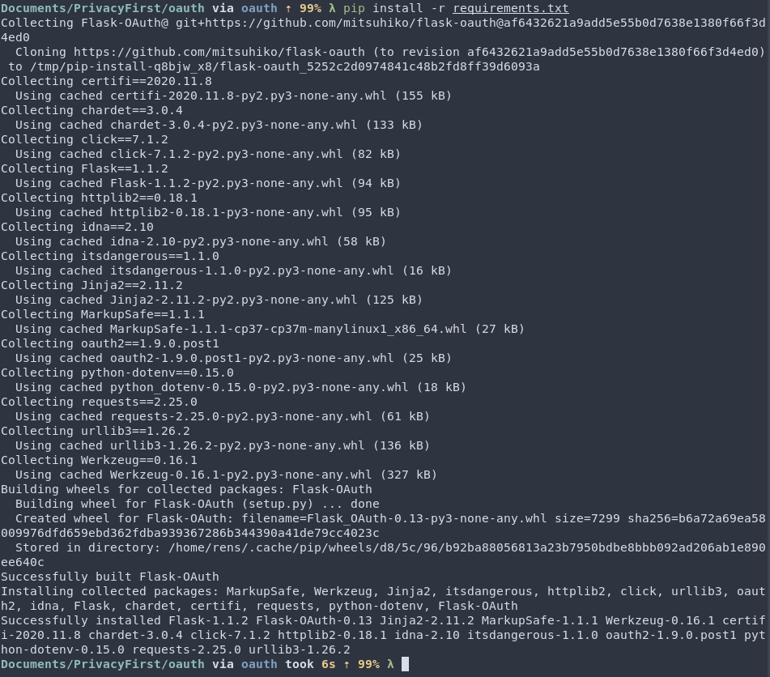
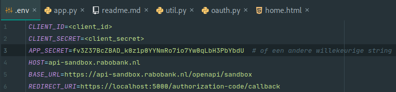
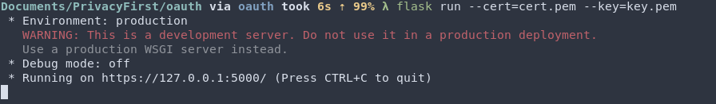
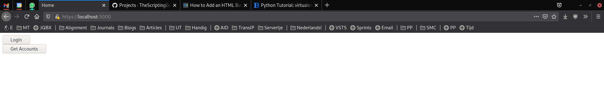
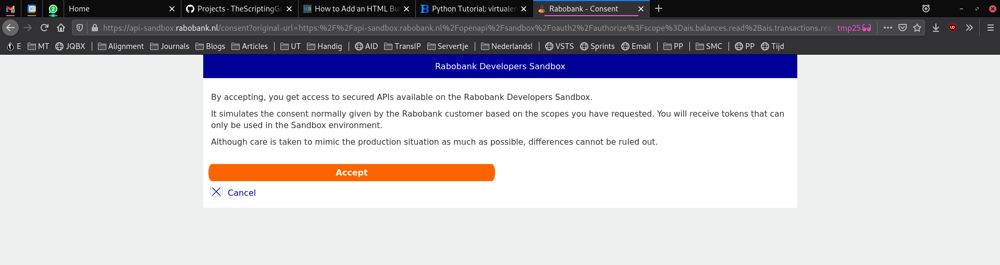
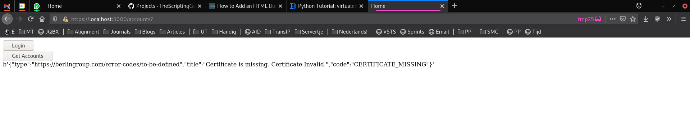

## Python-setup

Maak een virtual environment aan (python3)    

Activeer de virtual environment  

Installeer de dependencies  

## Run applicatie
Stel de .env in  

Run de applicatie  

Ga naar de lokaal-runnende server  

Login  

Get accounts  
